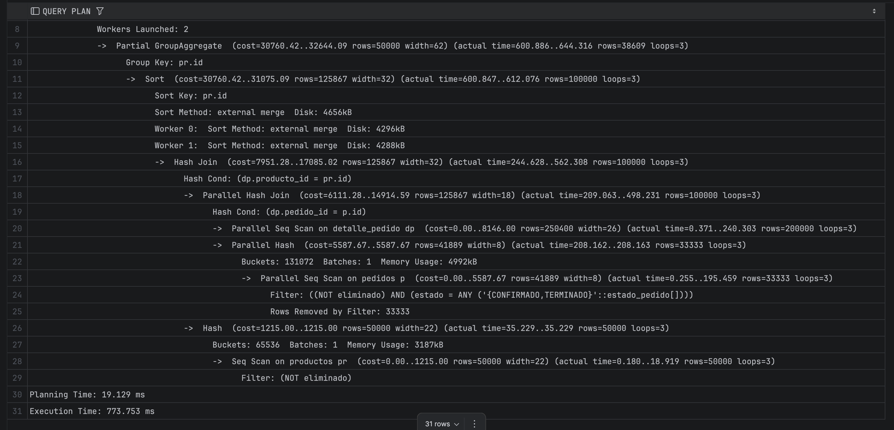
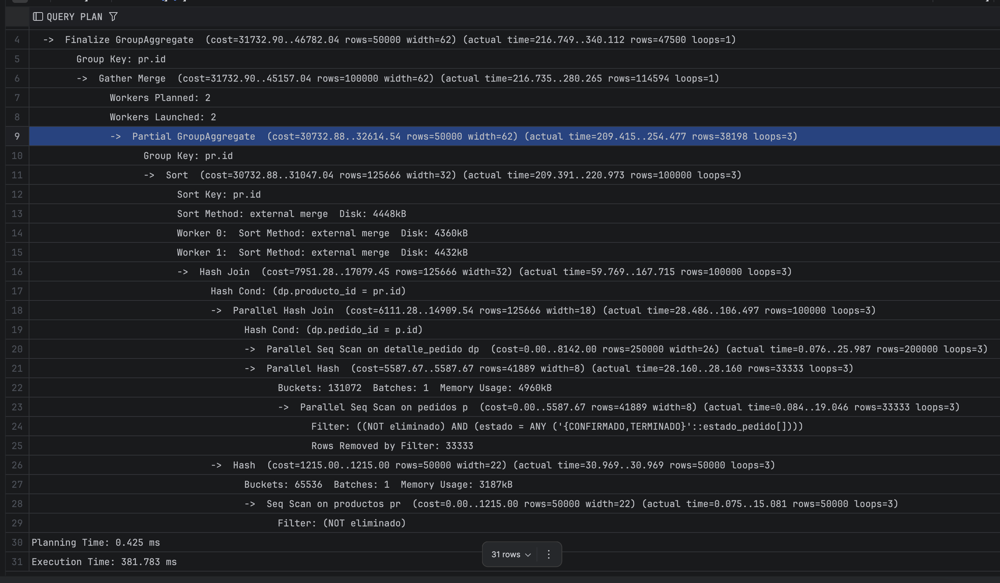
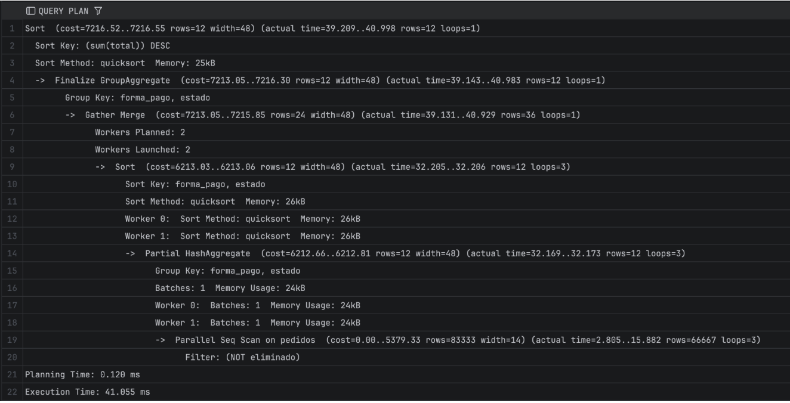
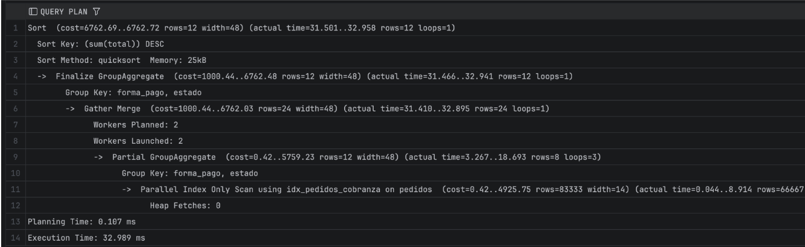
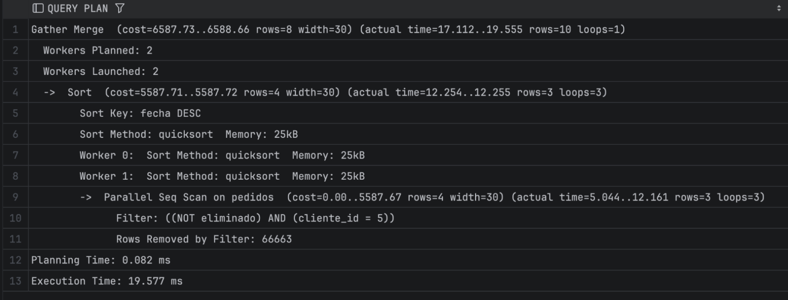
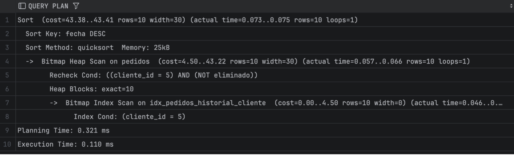
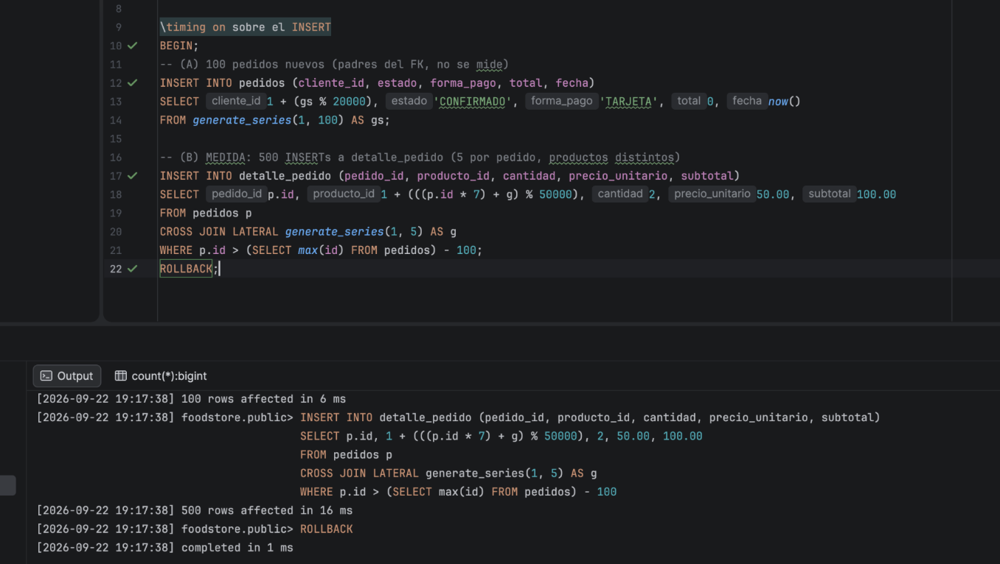
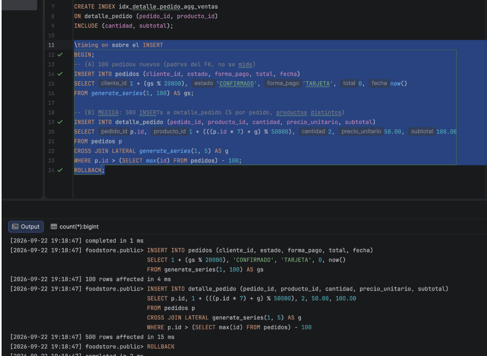

# Informe de Optimización de Consultas SQL e Índices

---

## Consulta Nº 1: Ranking de Ventas por Producto

### Consulta
```sql

EXPLAIN ANALYZE
SELECT pr.id, pr.nombre,
     SUM(dp.cantidad) AS unidades_vendidas,
     SUM(dp.subtotal) AS total_vendido
FROM detalle_pedido dp
JOIN pedidos p    ON p.id = dp.pedido_id
JOIN productos pr ON pr.id = dp.producto_id
WHERE p.estado IN ('CONFIRMADO', 'TERMINADO')
 AND p.eliminado = FALSE
 AND pr.eliminado = FALSE
GROUP BY pr.id, pr.nombre
ORDER BY total_vendido DESC;
```

### ANÁLISIS SIN ÍNDICES




> Nodo principal: Parallel Seq Scan on detalle_pedido ... (rows=47500)
> Planning Time: 19.129 ms — Execution Time: 773.753 ms


### PROPUESTAS DE LA IA: CREACIÓN DE ÍNDICES

1. **Índice parcial sobre `pedidos`:**
   * **Columnas:** `(estado, eliminado)`. `estado` primero por selectividad: `estado IN ('CONFIRMADO', 'TERMINADO')` descarta ~50% de la tabla, mientras `eliminado = FALSE` apenas descarta la baja lógica.
   * **Condición:** Replica el predicado del `WHERE`.

   ```sql
   CREATE INDEX idx_pedidos_volumen_venta
   ON pedidos (estado, eliminado)
   WHERE estado IN ('CONFIRMADO', 'TERMINADO')
     AND eliminado = FALSE;
   ```

2. **Índice covering de apoyo sobre `detalle_pedido`:**
   * Permite realizar el JOIN `pedidos` $\rightarrow$ `detalle_pedido` y la agregación `SUM(cantidad)`, `SUM(subtotal)` sin acceder al heap.
   * **`pedido_id`:** Clave de acceso del JOIN.
   * **`producto_id`:** Para la agrupación por producto.
   * **`INCLUDE (cantidad, subtotal)`:** Datos adicionales necesarios únicamente para la agregación.

   ```sql
   CREATE INDEX idx_detalle_pedido_agg_ventas
   ON detalle_pedido (pedido_id, producto_id)
   INCLUDE (cantidad, subtotal);
   ```

### ANÁLISIS CON ÍNDICES



> detalle_pedido: Parallel Seq Scan (rows=47500) — lectura completa inevitable (la consulta no filtra esta tabla).
> pedidos: acceso por índice parcial idx_pedidos_volumen_venta (antes: Parallel Seq Scan)
> Planning Time: 0.425 ms — Execution Time: 381.783 ms comparado con 773.753 ms sin índices (~50% más rápido)


### DESCARTE DE PROPUESTAS POR LA IA 

* **Propuesta evaluada:** Creación de índices individuales o secundarios sobre `pedidos(estado)` o `pedidos(eliminado)` sin filtro parcial.
* **Justificación del descarte:** Redundancia y baja cardinalidad. Dado que la consulta filtra por un grupo reducido de estados válidos, la creación de `idx_pedidos_volumen_venta` de forma parcial cubre eficientemente el conjunto de datos requerido. Agregar índices individuales adicionales sobre `estado` o `eliminado` solo aportaría un costo de mantenimiento sobre la tabla `pedidos` durante operaciones `INSERT` y `UPDATE` sin aportar valor al optimizador.


---

## Consulta Nº 2: Resumen de Cobranzas y Estados de Pedidos

### Consulta

```sql
SELECT forma_pago, estado, COUNT(*) AS cantidad_pedidos, SUM(total) AS monto
FROM pedidos
WHERE eliminado = FALSE
GROUP BY forma_pago, estado
ORDER BY monto DESC;

```


### ANÁLISIS SIN ÍNDICES


> Nodo principal: Parallel Seq Scan on pedidos ...
> Planning Time: 0.120 ms — Execution Time: 41.055 ms


### PROPUESTAS DE LA IA: CREACIÓN DE ÍNDICES

> **Objetivo:** Convertir el `Parallel Seq Scan` (~200k filas) en un `Index-Only Scan` para todo el `GROUP BY`.

* **Columnas:** `(forma_pago, estado)` en el mismo orden del `GROUP BY` para alimentar la agregación de manera ordenada.
* **`INCLUDE (total)`:** Permite realizar la suma directamente desde el índice.
* **Índice parcial:** `WHERE eliminado = FALSE`.

```sql
CREATE INDEX idx_pedidos_cobranza
ON pedidos (forma_pago, estado)
INCLUDE (total)
WHERE eliminado = FALSE;
```


### ANÁLISIS CON ÍNDICES


> Nodo principal:  Index Only Scan using idx_pedidos_cobranza ...
> Planning Time: 0.107 ms — Execution Time: 32.989ms

### DESCARTE DE PROPUESTAS POR LA IA 
* **Propuesta evaluada:** Variante alternativa de `idx_pedidos_cobranza` con condición parcial reducida `WHERE estado IN ('CONFIRMADO', 'TERMINADO') AND eliminado = FALSE`.
* **Justificación del descarte:** Sobreindexación por duplicación. Mantener ambas versiones del índice para la misma agregación de cobranza duplicaría el espacio ocupado en disco para la tabla `pedidos`. Se optó por la versión con condición parcial general `WHERE eliminado = FALSE` para cubrir el `GROUP BY` completo de la consulta.


---


## Consulta Nº 3: Historial de Pedidos por Cliente

### Consulta

```sql
SELECT id, fecha, estado, forma_pago, total
FROM pedidos
WHERE cliente_id = 5 AND eliminado = FALSE
ORDER BY fecha DESC;
```


### ANÁLISIS SIN ÍNDICES



> Nodo principal: Parallel Seq Scan on pedidos ... + Sort
> Planning Time: 0.082 ms — Execution Time: 19.577 ms

### PROPUESTAS DE LA IA: CREACIÓN DE ÍNDICES

> **Objetivo:** Reemplazar el `Parallel Seq Scan` (~200k filas) por un `Index-Only Scan` puntual (~10 filas) y eliminar la etapa de ordenamiento (`Sort`).

* **`cliente_id`:** Igualdad altamente selectiva (reduce el universo de ~200k a ~10 filas).
* **`fecha DESC`:** Mismo ordenamiento del `ORDER BY`, por lo que entrega las filas ya ordenadas y elimina la operación de `Sort`.
* **`INCLUDE (estado, forma_pago, total)`:** Proyección de campos requeridos para lograr un covering total sin ir a la tabla.
* **Índice parcial:** `WHERE eliminado = FALSE` para reducir el tamaño del índice y evitar rechecks.

```sql
CREATE INDEX idx_pedidos_historial_cliente
ON pedidos (cliente_id, fecha DESC)
INCLUDE (estado, forma_pago, total)
WHERE eliminado = FALSE;
```


### ANÁLISIS CON ÍNDICES


> Nodo principal: Index Only Scan using idx_pedidos_historial_cliente ...  — sin Sort
> Planning Time: 0.321 ms — Execution Time: 0.110 ms  

### DESCARTE DE PROPUESTAS POR LA IA 

* **Propuesta evaluada:** Crear un índice B-Tree tradicional únicamente sobre `pedidos(cliente_id)`.
* **Justificación del descarte:** Redundancia de prefijo. El índice implementado `idx_pedidos_historial_cliente (cliente_id, fecha DESC) INCLUDE (...)` utiliza `cliente_id` como columna líder. PostgreSQL puede reutilizar la columna inicial de un índice compuesto para resolver cualquier filtro que solo busque por `cliente_id`, por lo que mantener un índice exclusivo adicional resultaría en sobreindexación pura.


--- 

## IMPACTO EN LA INSERCIÓN DE NUEVOS REGISTROS

### 1. Inserción de Registros **SIN** el índice idx_detalle_pedido_agg_ventas
 

> SIN índice: Time: 16 ms


### 2. Inserción de Registros **CON** el índice idx_detalle_pedido_agg_ventas

 

> CON índice: Time: 15ms  


### CONCLUSIÓN

Aunque los índices optimizan significativamente las consultas de lectura, introducen un costo adicional (*overhead*) en cada operación de escritura, ya que la base de datos debe actualizar tanto la tabla como sus índices asociados.

En esta prueba comparativa medimos el tiempo de inserción de un lote de 500 registros en la tabla `detalle_pedido`, antes y después de crear el índice covering `idx_detalle_pedido_agg_ventas`:

| Escenario | Tiempo total |
| :--- | :--- |
| **SIN** `idx_detalle_pedido_agg_ventas` | 16 ms |
| **CON** `idx_detalle_pedido_agg_ventas` | 15 ms |
| **Delta (costo del índice)** | ~1 ms (variación dentro del margen de error) |

El resultado muestra que el tiempo de ejecución es prácticamente idéntico (con una diferencia de ~1 ms atribuible a la variabilidad normal del entorno). ¿Por qué el impacto en la escritura fue imperceptible?

1. **Tamaño del lote reducido:** Al ser solo 500 filas, las inserciones en la estructura B-Tree $O(\log n)$ requieren modificar un número muy reducido de páginas de índice.
2. **Uso eficiente de la memoria caché (`shared_buffers`):** PostgreSQL mantiene en RAM las páginas más frecuentemente accedidas. Al estar las páginas en memoria gracias a las ejecuciones previas, la actualización del índice no requirió operaciones I/O en disco.
3. **Impacto localizado:** El mantenimiento del índice en escrituras quedó acotado a una sola estructura adicional sobre la tabla `detalle_pedido`.