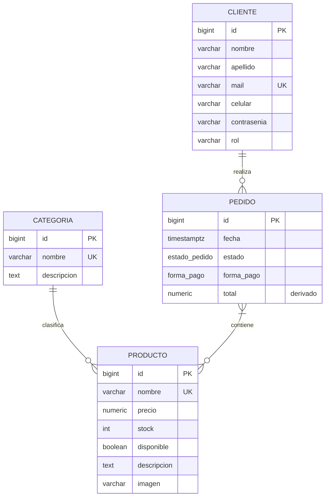

# 01 — Modelo Entidad-Relación (ER) de Food Store

> **TPI «Food Store» — Primera entrega parcial · Objetivo 1 de la consigna:**
> *Modelo ER (entidades, atributos, claves, cardinalidad, participación).*
> Motor de referencia: PostgreSQL 16+ · Implementación: [`db/01_ddl_schema.sql`](../db/01_ddl_schema.sql)
> Siguiente paso: [`02_modelo_relacional.md`](02_modelo_relacional.md) → [`03_normalizacion.md`](03_normalizacion.md)

## 1. Descripción del dominio

Food Store es una tienda de alimentos. Los **clientes** realizan **pedidos**; cada pedido incluye uno o más **productos** en cierta cantidad; cada producto pertenece a una **categoría**. El sistema debe conservar el historial de ventas aunque un producto, un cliente o una categoría se den de baja (borrado lógico).

## 2. Entidades, atributos y claves

Notación: **PK** = clave primaria · **CC** = clave candidata (restricción `UNIQUE`) · **FK** = clave foránea · *(derivado)* = atributo que se puede calcular a partir de otros.

### 2.1 Entidad `CATEGORIA` (entidad fuerte)

| Atributo | Dominio | Clave | Observación |
| :--- | :--- | :--- | :--- |
| id | entero (IDENTITY) | **PK** | Clave sustituta generada por el motor |
| nombre | texto(100), obligatorio | **CC** | Una categoría no puede repetir nombre |
| descripcion | texto, opcional | | |
| eliminado, created_at, updated_at, deleted_at | auditoría y borrado lógico | | Comunes a las 4 entidades fuertes (ver 2.6) |

### 2.2 Entidad `PRODUCTO` (entidad fuerte)

| Atributo | Dominio | Clave | Observación |
| :--- | :--- | :--- | :--- |
| id | entero (IDENTITY) | **PK** | |
| nombre | texto(100), obligatorio | **CC** | |
| precio | decimal(10,2) ≥ 0 | | Precio **vigente** (el precio de cada venta se guarda en la relación `CONTIENE`) |
| descripcion, imagen | texto, opcional | | |
| stock | entero ≥ 0 | | |
| disponible | booleano | | |
| categoria_id | entero | **FK** → CATEGORIA | Implementa la relación `CLASIFICA` |
| auditoría / borrado lógico | | | ver 2.6 |

### 2.3 Entidad `CLIENTE` (entidad fuerte)

| Atributo | Dominio | Clave | Observación |
| :--- | :--- | :--- | :--- |
| id | entero (IDENTITY) | **PK** | |
| nombre, apellido | texto(100), obligatorios | | |
| mail | texto(100), obligatorio, con `@` | **CC** | Identifica al cliente de forma natural |
| celular | texto(30), obligatorio | | |
| contrasenia | texto(255), obligatorio | | Se guarda el hash, nunca texto plano; **ninguna vista la expone** |
| rol | texto(50), obligatorio | | |
| auditoría / borrado lógico | | | ver 2.6 |

### 2.4 Entidad `PEDIDO` (entidad fuerte)

| Atributo | Dominio | Clave | Observación |
| :--- | :--- | :--- | :--- |
| id | entero (IDENTITY) | **PK** | |
| fecha | fecha y hora con zona (`TIMESTAMPTZ`) | | Por defecto, el momento de creación |
| estado | `ENUM estado_pedido` = PENDIENTE, CONFIRMADO, TERMINADO, CANCELADO | | Transiciones controladas por trigger |
| forma_pago | `ENUM forma_pago` = TARJETA, TRANSFERENCIA, EFECTIVO | | |
| total | decimal(12,2) ≥ 0 | | *(derivado)* = Σ subtotal de sus renglones; se guarda por rendimiento (ver [normalización](03_normalizacion.md)) |
| cliente_id | entero | **FK** → CLIENTE | Implementa la relación `REALIZA` |
| auditoría / borrado lógico | | | ver 2.6 |

### 2.5 Relación N:M `CONTIENE` entre `PEDIDO` y `PRODUCTO` (con atributos propios)

Un pedido contiene varios productos y un producto aparece en varios pedidos: **N:M**. La relación tiene atributos propios, por eso en el modelo relacional se convierte en una tabla (`detalle_pedido`):

| Atributo de la relación | Dominio | Observación |
| :--- | :--- | :--- |
| cantidad | entero > 0 | Unidades pedidas |
| precio_unitario | decimal(10,2) ≥ 0 | **Foto del precio al momento de la venta**: no cambia si luego cambia `PRODUCTO.precio` |
| subtotal | decimal(12,2) ≥ 0 | *(derivado)* = cantidad × precio_unitario; protegido con `CHECK` |

Identificador de cada ocurrencia: el par (pedido, producto) — una línea por producto dentro de un pedido (`UNIQUE (pedido_id, producto_id)`).

### 2.6 Atributos comunes de auditoría y borrado lógico

Las entidades `CATEGORIA`, `PRODUCTO`, `CLIENTE` y `PEDIDO` tienen: `eliminado` (booleano, por defecto `FALSE`), `created_at`, `updated_at` y `deleted_at` (`TIMESTAMPTZ`; `deleted_at` es `NULL` mientras el registro esté vigente). Ver [`db/10_borrado_logico.sql`](../db/10_borrado_logico.sql).

## 3. Diagrama ER

Notación *pata de gallo* (crow's foot). Los círculos/barras de los extremos expresan la **participación mínima** y la cardinalidad máxima: `||` exactamente uno · `o{` cero o muchos · `|{` uno o muchos.

> La relación `CONTIENE` es **N:M con atributos propios** (`cantidad`, `precio_unitario`, `subtotal`); por eso en el paso al modelo relacional se resuelve con la tabla intermedia `detalle_pedido` (ver [`02_modelo_relacional.md`](02_modelo_relacional.md)). Los atributos de auditoría / borrado lógico (2.6) no se dibujan para no saturar el diagrama.

## 4. Relaciones: cardinalidad y participación

Participación expresada como **(mínimo, máximo)** de ocurrencias de la relación en las que interviene cada entidad.

| Relación | Entidad A | Entidad B | Cardinalidad | Participación A | Participación B | Cómo se garantiza |
| :--- | :--- | :--- | :---: | :---: | :---: | :--- |
| **CLASIFICA** | CATEGORIA | PRODUCTO | **1 : N** | (0,N) **parcial**: puede haber categorías sin productos | (1,1) **total**: todo producto tiene exactamente una categoría | `productos.categoria_id` `NOT NULL` + FK |
| **REALIZA** | CLIENTE | PEDIDO | **1 : N** | (0,N) **parcial**: un cliente puede no haber comprado | (1,1) **total**: todo pedido es de un único cliente | `pedidos.cliente_id` `NOT NULL` + FK |
| **CONTIENE** | PEDIDO | PRODUCTO | **N : M** | (1,N) **total**: un pedido tiene al menos un renglón | (0,N) **parcial**: un producto puede no haberse vendido nunca | Tabla `detalle_pedido` con 2 FK. El mínimo 1 del pedido es regla de negocio aplicada por el procedimiento `sp_crear_pedido` (el DDL por sí solo permitiría una cabecera sin renglones) |

## 5. Claves

| Entidad | Clave primaria | Claves candidatas (`UNIQUE`) | Por qué clave sustituta |
| :--- | :--- | :--- | :--- |
| CATEGORIA | `id` | `nombre` | Los nombres pueden corregirse; el `id` no cambia nunca |
| PRODUCTO | `id` | `nombre` | Ídem; además las FK de `detalle_pedido` son más compactas |
| CLIENTE | `id` | `mail` | El mail puede cambiar; el `id` es estable |
| PEDIDO | `id` | — | No hay atributo natural único |
| CONTIENE (`detalle_pedido`) | `id` | `(pedido_id, producto_id)` | Clave candidata compuesta; el `id` simplifica referencias |

Las claves sustitutas son `BIGINT GENERATED ALWAYS AS IDENTITY` (estándar SQL, PostgreSQL 10+).

## 6. Reglas de negocio asociadas al modelo

| Regla | Dónde se implementa |
| :--- | :--- |
| Precio, stock, total, cantidad, subtotal no negativos; cantidad > 0 | `CHECK` en [`01_ddl_schema.sql`](../db/01_ddl_schema.sql) |
| `subtotal = cantidad × precio_unitario` | `CHECK chk_detalle_subtotal_coherente` en [`02_reglas_negocio_check_unique_triggers.sql`](../db/02_reglas_negocio_check_unique_triggers.sql) |
| Un producto no se repite dentro de un pedido | `UNIQUE (pedido_id, producto_id)` |
| Transiciones válidas de estado del pedido | Trigger `trg_pedidos_transicion_estado` (script 02) |
| No dar de baja un cliente con pedidos PENDIENTE/CONFIRMADO | Trigger `trg_clientes_baja_logica` (script 02) |
| No perder historial al dar de baja | `ON DELETE RESTRICT` en todas las FK + borrado lógico |
