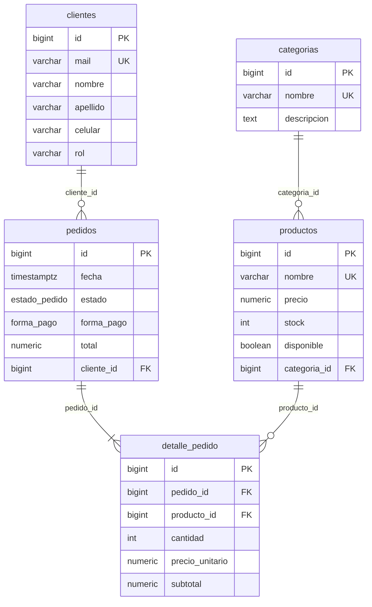

# 02 — Paso del modelo ER al modelo relacional

> **TPI «Food Store» — Primera entrega parcial · Objetivo 2 de la consigna:**
> *Paso de ER a modelo relacional, incluyendo relaciones 1:N y N:M resueltas mediante tablas intermedias.*
> Parte de: [`01_modelo_er.md`](01_modelo_er.md) · Implementación: [`db/01_ddl_schema.sql`](../db/01_ddl_schema.sql) · Siguiente: [`03_normalizacion.md`](03_normalizacion.md)

## 1. Reglas de transformación aplicadas

| # | Elemento del ER | Regla | Resultado en Food Store |
| :-: | :--- | :--- | :--- |
| R1 | Entidad fuerte | Una entidad → una relación (tabla). Atributos → columnas. Atributo identificador → PK | `categorias`, `productos`, `clientes`, `pedidos` |
| R2 | Atributo clave candidata | Restricción `UNIQUE` (+ `NOT NULL`) | `categorias.nombre`, `productos.nombre`, `clientes.mail` |
| R3 | Relación **1:N** | La **PK del lado 1 viaja como FK al lado N**. Si la participación del lado N es total, la FK es `NOT NULL` | `CLASIFICA`: `productos.categoria_id → categorias.id` · `REALIZA`: `pedidos.cliente_id → clientes.id` |
| R4 | Relación **N:M** | **No se puede representar con una FK**: se crea una **relación intermedia (asociativa)** con las PK de ambas entidades como FK. Los atributos de la relación pasan a ser columnas de la intermedia | `CONTIENE` → `detalle_pedido(pedido_id, producto_id, cantidad, precio_unitario, subtotal)` |
| R5 | Identificador de la intermedia | La combinación de las dos FK es clave candidata (`UNIQUE`); se agrega PK sustituta por simplicidad | `UNIQUE (pedido_id, producto_id)` + `id` IDENTITY |
| R6 | Dominio enumerado | Tipo `ENUM` propio del motor | `estado_pedido`, `forma_pago` |
| R7 | Integridad referencial | FK con acción de borrado explícita | `ON DELETE RESTRICT` en las 4 FK: no se puede borrar un registro referenciado (se usa borrado lógico) |

## 2. Esquema relacional resultante

Notación: `PK` = clave primaria · `FK` = clave foránea (→ tabla referenciada) · `UK` = clave candidata. Las columnas de auditoría y borrado lógico (`eliminado, created_at, updated_at, deleted_at`) se omiten en las cuatro tablas fuertes por brevedad.

```
categorias     ( id PK, nombre UK, descripcion )

productos      ( id PK, nombre UK, precio, descripcion, stock, imagen, disponible,
                 categoria_id FK → categorias.id )

clientes       ( id PK, nombre, apellido, mail UK, celular, contrasenia, rol )

pedidos        ( id PK, fecha, estado, total, forma_pago,
                 cliente_id FK → clientes.id )

detalle_pedido ( id PK, pedido_id FK → pedidos.id, producto_id FK → productos.id,
                 cantidad, precio_unitario, subtotal,
                 UK (pedido_id, producto_id) )
```

### Diagrama relacional (tablas y claves foráneas)



## 3. Cómo se resolvió cada relación

### 3.1 Relaciones 1:N (regla R3)

| Relación ER | Lado 1 (PK referenciada) | Lado N (FK) | Restricción en el DDL | `NOT NULL` (participación total) |
| :--- | :--- | :--- | :--- | :---: |
| CLASIFICA (1:N) | `categorias.id` | `productos.categoria_id` | `fk_producto_categoria … ON DELETE RESTRICT` | Sí |
| REALIZA (1:N) | `clientes.id` | `pedidos.cliente_id` | `fk_pedido_cliente … ON DELETE RESTRICT` | Sí |

### 3.2 Relación N:M resuelta con tabla intermedia (regla R4)

`PEDIDO` N:M `PRODUCTO` ⟶ **`detalle_pedido`**:

```
 pedidos (1) ──────< detalle_pedido >────── (1) productos
              pedido_id           producto_id
              (fk_detalle_pedido) (fk_detalle_producto)
```

* La N:M se descompone en **dos relaciones 1:N**: un pedido tiene muchos renglones y un producto aparece en muchos renglones.
* `cantidad`, `precio_unitario` y `subtotal` son atributos de la **relación** (no del pedido ni del producto), por eso viven en `detalle_pedido`.
* `UNIQUE (pedido_id, producto_id)` impide repetir un producto dentro del mismo pedido.

## 4. Verificación contra el catálogo de PostgreSQL

Consulta ejecutada sobre la base creada con `01_ddl_schema.sql` + `02_reglas_negocio_check_unique_triggers.sql` (PostgreSQL 17.11):

```sql
SELECT conrelid::regclass AS tabla, conname AS restriccion, contype AS tipo,
       pg_get_constraintdef(oid) AS definicion
FROM pg_constraint
WHERE connamespace = 'public'::regnamespace AND contype IN ('p','f','u')
ORDER BY conrelid::regclass::text, contype, conname;
```

| tabla | restricción | tipo | definición |
| :--- | :--- | :---: | :--- |
| categorias | categorias_pkey | p | PRIMARY KEY (id) |
| categorias | categorias_nombre_key | u | UNIQUE (nombre) |
| clientes | clientes_pkey | p | PRIMARY KEY (id) |
| clientes | clientes_mail_key | u | UNIQUE (mail) |
| detalle_pedido | detalle_pedido_pkey | p | PRIMARY KEY (id) |
| detalle_pedido | **fk_detalle_pedido** | **f** | FOREIGN KEY (pedido_id) REFERENCES pedidos(id) ON DELETE RESTRICT |
| detalle_pedido | **fk_detalle_producto** | **f** | FOREIGN KEY (producto_id) REFERENCES productos(id) ON DELETE RESTRICT |
| detalle_pedido | uq_detalle_pedido_producto | u | UNIQUE (pedido_id, producto_id) |
| pedidos | pedidos_pkey | p | PRIMARY KEY (id) |
| pedidos | **fk_pedido_cliente** | **f** | FOREIGN KEY (cliente_id) REFERENCES clientes(id) ON DELETE RESTRICT |
| productos | productos_pkey | p | PRIMARY KEY (id) |
| productos | productos_nombre_key | u | UNIQUE (nombre) |
| productos | **fk_producto_categoria** | **f** | FOREIGN KEY (categoria_id) REFERENCES categorias(id) ON DELETE RESTRICT |

Se obtienen **4 claves foráneas** (2 de relaciones 1:N + 2 de la N:M resuelta), **5 claves primarias** y **4 claves candidatas**: coincide con el esquema derivado en la sección 2.

## 5. Orden de creación y de carga (consecuencia de las FK)

`categorias` → `clientes` → `productos` → `pedidos` → `detalle_pedido`. Para eliminar o truncar, el orden inverso (o `TRUNCATE … CASCADE`, como hace [`04_dml_carga_masiva.sql`](../db/04_dml_carga_masiva.sql)).
